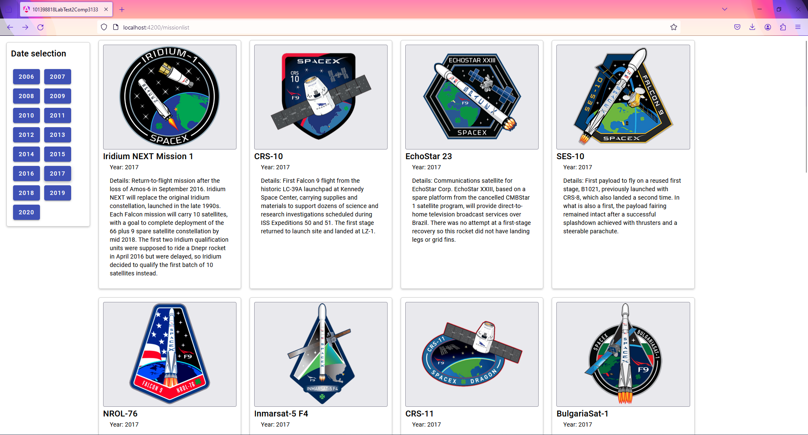

# 101398818LabTest2Comp3133

This Program uses Angular Material components to present the data given by SpaceX

## List

When the user Selects a year from the list, the program makes an api call to get the
Launches for that specific year, and refreshes the default list

## Details

When selected the image from the list, the user is redirected to a page with more details about
the launch.

